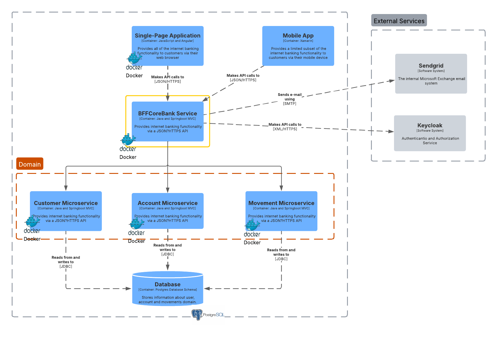

## Prueba Técnica

### Microservicios
```
1.- Account
2.- Customer
3.- Movement - Report
```

### Back for fronend
```
1.- bffcorebank
```

### Frontend
```
1.- bpcp-frontend
```

### Build and Run Project
```
Create Network for Microservice, Db, Frontend (Comunication)
docker network create bcpc


Go to Account MicroService

docker build . -t account-image:1.0.0
docker run -d  --name account-ms --network=bcpc -p 9095:9095 account-image:1.0.0

Go to Movement MicroService
docker build . -t movement-image:1.0.0
docker run -d --name movement-ms --network=bcpc -p 9080:9080 movement-image:1.0.0

Go to Customer MicroService
docker build . -t customer-image:1.0.0
docker run -d --name customer-ms --network=bcpc -p 9090:9090 customer-image:1.0.0

Go to bffcorebank Middleware
docker run -d --name bffcorebank-ms --network=bcpc -p 8080:8080 bffcorebank-image:1.0.0

Go to bpcp-frontend
docker build . -t bcpc-image:1.0.0
docker run -d  --name bcpc-frontend --network=bcpc -p 4200:4200 bcpc-image:1.0.0 

```

### Arquitectura de Microservicios Propuesta



### Collection Postman
```
1.- BPC.postman_collection.json
```
### Script DB and Docker Compose
```
Go to database
docker-compose up --build -d
```

